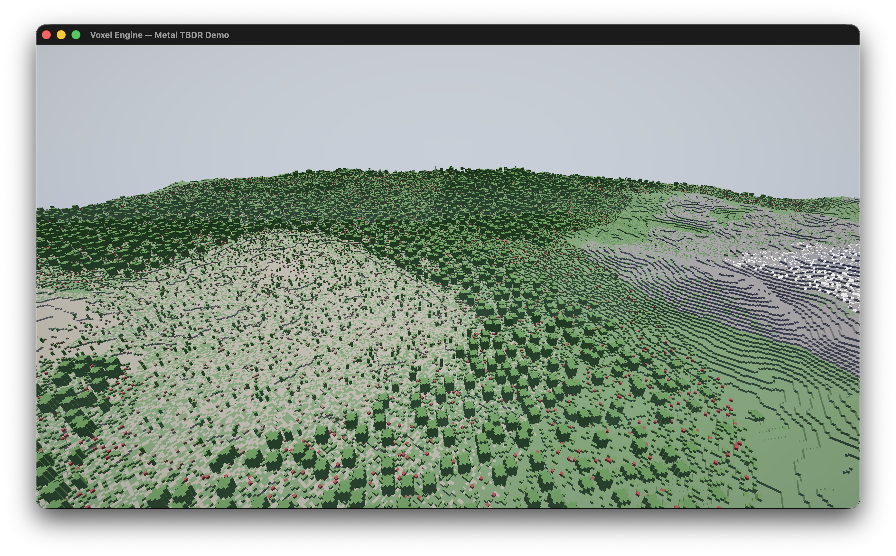

<div align="right">

[🇬🇧](README.md) | 🇷🇺

</div>

<div align="center">

# Metalcraft

Воксельный движок с нуля на Swift + Metal для Apple Silicon

Эксперимент — насколько далеко можно зайти на одном чипе M-серии без внешних зависимостей

<br>

[](https://github.com/plagness/Metalcraft/releases)
[](https://swift.org)
[](https://developer.apple.com/metal/)
[](https://www.apple.com/macos/)
[](https://support.apple.com/en-us/116943)
[](LICENSE)

<br>



<br>

[Архитектура](docs/architecture.md) · [Производительность](docs/performance.md) · [Шейдеры](docs/shaders.md) · [Система чанков](docs/chunk-system.md) · [Changelog](CHANGELOG.md)

</div>

---

## ✨ Возможности

### 🎨 Рендеринг
- Single-pass deferred рендеринг, оптимизированный под GPU Apple Silicon
- PBR-освещение Cook-Torrance (GGX + Smith + Schlick)
- G-Buffer целиком в on-chip tile memory — не попадает в DRAM
- 16 анимированных точечных источников + направленное солнце + полусферический ambient
- Bloom (Kawase blur, 4 mip-уровня)
- ACES filmic tone mapping
- Атмосферный туман (дистанция + высота)
- Вода с forward-прозрачностью

### 🌍 Мир
- Воксельные чанки 16×16×16, дальность прорисовки 64 чанка (1 024 блока)
- До 100 000 загруженных чанков, 4 500 отрисовка за кадр
- GPU compute генерация террейна — Perlin noise, в 10–50× быстрее CPU
- 6 биомов с плавным смешиванием: Океан, Равнины, Лес, Пустыня, Горы, Тундра
- 27 типов блоков с PBR-свойствами (roughness, metallic, emission, transparency)
- Пещеры и расстановка деревьев

### ⚡ Производительность
- Greedy meshing — объединение соседних граней в крупные quad'ы
- Упакованная вершина 16 байт (вместо 48 наивных)
- Mega-buffer: 128 МБ вершинный + 64 МБ индексный, один bind на кадр
- Indirect Command Buffer: 4 500 draw → 1 GPU-команда
- 4-уровневый LOD (шаг 1/2/4/8 по дистанции)
- Frustum culling с кэшированием
- Тройная буферизация (3 кадра в полёте)

### ✨ Эффекты
- 8 192 GPU-частицы (compute shader)
- Bloom (Kawase 5-tap/9-tap, 4 mip каскада)
- Виньетка

### 🤖 Neural Engine
- Подготовлен модуль `NeuralEngine/` для интеграции CoreML / ANE
- Планируется: ML-апскейлинг, деноизинг, предсказание LOD
- [Подробнее →](docs/neural-engine.md)

---

## 🚀 Быстрый старт

```bash
git clone https://github.com/plagness/Metalcraft.git
cd Metalcraft
open VoxelEngine.xcodeproj
# Cmd+R для сборки и запуска
```

Или перегенерировать через XcodeGen:
```bash
brew install xcodegen
xcodegen generate
open VoxelEngine.xcodeproj
```

### 🎮 Управление

| Клавиша | Действие |
|---|---|
| `W` `A` `S` `D` | Движение |
| `Мышь` | Осмотр |
| `Пробел` | Вверх |
| `Shift` | Вниз |
| `Tab` | Спринт (5×) |
| `Скролл` | Скорость |
| `Esc` | Захват курсора |

---

## 📋 Требования

| | Минимум |
|---|---|
| **ОС** | macOS 14.0 (Sonoma) |
| **Железо** | Apple Silicon (M1+) |
| **GPU** | Metal GPU Family Apple 7+ |
| **Xcode** | 15.0+ |
| **Swift** | 5.9 |

> ⚠️ Intel Mac не поддерживается — нужна unified memory Apple Silicon.

## 🧰 Фреймворки

`Metal` · `MetalKit` · `simd` · `CoreGraphics` · `CoreText` · `Cocoa` · `QuartzCore` · `Foundation`

Ноль внешних зависимостей. Без SPM. Без CocoaPods. Без Carthage.

---

## 📁 Структура

```
Metalcraft/
├── VoxelEngine/
│   ├── App/              Точка входа, окно, контроллер
│   ├── Core/             Отсчёт времени
│   ├── Input/            Клавиатура + мышь FPS
│   ├── Math/             Шум, frustum culling
│   ├── Renderer/         Metal-рендерер, камера, mega-buffer
│   ├── Compute/          GPU-генерация террейна
│   ├── Voxel/            Чанки, блоки, greedy mesher, вода
│   ├── Debug/            FPS-оверлей
│   ├── Shaders/
│   │   ├── Common/       ShaderTypes.h (Swift↔Metal bridging)
│   │   ├── Deferred/     G-Buffer + PBR-освещение
│   │   ├── Transparency/ Forward-проход воды
│   │   ├── Particles/    GPU compute + billboard
│   │   ├── PostProcess/  Bloom, tone mapping
│   │   ├── Voxel/        GPU compute террейна
│   │   └── Utility/      Полноэкранный треугольник
│   ├── NeuralEngine/     [В разработке] CoreML / ANE
│   └── ECS/              [В разработке] Entity-Component-System
├── docs/                 Техническая документация
├── Screenshots/          Скриншоты билда
├── project.yml           Определение XcodeGen
└── VoxelEngine.xcodeproj Готов к сборке
```

---

## 🗺️ Дорожная карта

- [ ] Neural Engine / CoreML (ANE-апскейлинг, деноизинг)
- [ ] Entity-Component-System
- [ ] Пространственный звук
- [ ] Каскадные тени
- [ ] Текстурный атлас
- [ ] Ray tracing (Metal RT API)
- [ ] Сохранение мира
- [ ] Объёмный туман и облака

## 📖 Документация

- [Архитектура](docs/architecture.md) — рендер-пайплайн, deferred rendering, tile memory
- [Производительность](docs/performance.md) — метрики, бенчмарки, анализ bandwidth
- [Шейдеры](docs/shaders.md) — Metal-шейдеры, PBR, bloom, частицы
- [Система чанков](docs/chunk-system.md) — mega-buffer, ICB, greedy meshing, LOD
- [Neural Engine](docs/neural-engine.md) — планы интеграции CoreML / ANE

---

## 📄 Лицензия

```
Copyright 2026 plagness
Licensed under the Apache License, Version 2.0
```

Полный текст — [LICENSE](LICENSE).
